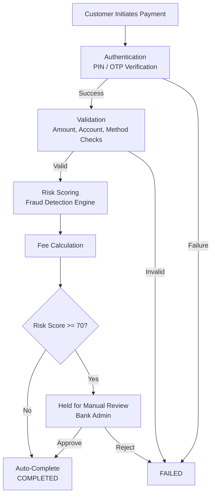

# Payment Workflow Diagram

```mermaid
flowchart TD
    A[Customer Initiates Payment] --> B[Authentication<br/>PIN / OTP Verification]
    B -->|Success| C[Validation<br/>Amount, Account, Method Checks]
    B -->|Failure| F[FAILED]
    C -->|Valid| D[Risk Scoring<br/>Fraud Detection Engine]
    C -->|Invalid| F
    D --> E[Fee Calculation]
    E --> G{Risk Score >= 70?}
    G -->|No| H[Auto-Complete<br/>COMPLETED]
    G -->|Yes| I[Held for Manual Review<br/>Bank Admin]
    I -->|Approve| H
    I -->|Reject| F
```
